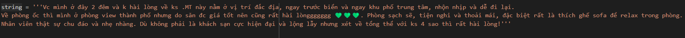
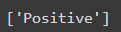

# Agoda Sentiment Analysis
## Giới thiệu
Agoda Sentiment Analysis là một hệ thống phân loại các đánh giá của khách hàng theo 3 nhãn là 'POSITIVE'(tích cực), 'NEGATIVE'(tiêu cực), 'NEUTRAL'(trung tính) và chỉ xử lý các đánh giá là tiếng Việt. Dựa trên các tính từ bộc lộ cảm xúc, hệ thống sẽ phân loại đánh giá đó thuộc nhãn nào cho người dùng.
## Dự đoán 

   
  <i>Đánh giá của khách hàng</i>

   
  <i>Dự đoán nhãn</i>

## Yêu cầu
* python 3.11
* spark 3.5.1
* JDK 11
* matplotlib
* seaborn
* underthesea
* langdetect
* scikit-learn
* gensim
